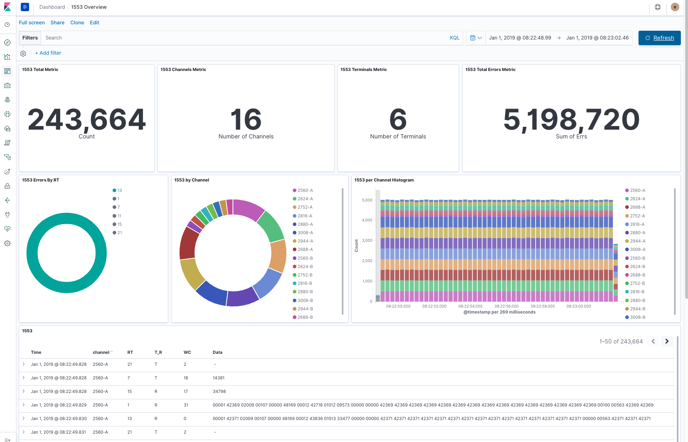

# mil-std-1553 to Elasticsearch

mil-std-1553 is a industrial control bus used by air and space craft.

IRIG 106 is a comprehensive telemetry standard to ensure interoperability in aeronautical telemetry application at RCC member ranges. It defines how to store 1553 data in Chapter 10 format.

IRIG 106 is developed and maintained by the Telemetry Group of the Range Commanders Council.

## Prerequisites
* Docker
* Filebeat
* Elasticsearch
* Kibana

## Build and run.

1. Clone this repo.
2. Edit es_curl_setup.sh, docker_build_run.sh and filebeat.yml files with your Elasticsearch server details.
3. In your newly cloned ./mil-std-1553-es, clone  https://github.com/bbaggerman/irig106lib and https://github.com/bbaggerman/irig106utils. Thank you bbaggerman!
4. Create a data_sets directory. Your directory structure should now look like the following:
```
./mil-std-1553-es
├── Dockerfile
├── Readme.md
├── data_sets
├── docker_build_run.sh
├── es_curl_setup.sh
├── filebeat.yml
├── irig106lib
│   ├── gcc
│   ├── msvs6
│   ├── python
│   ├── readme.txt
│   ├── src
│   ├── vs2005
│   ├── vs2008
│   ├── vs2010
│   ├── vs2012
│   ├── vs2015
│   └── vs2017
└── irig106utils
    ├── gcc
    ├── i106utils.txt
    ├── msvs6
    ├── src
    ├── vs2005
    ├── vs2008
    ├── vs2010
    ├── vs2012
    └── vs2017
```
5. Add your ch10 file to your ./data_sets directory. Samples can be downloaded from [here](http://www.irig106.org/wiki/sample_data_files)

   ```cp ~/TC-1553_107_132248.ch10 ./data_sets/```

6. Load the data into Elasticsearch:

   ```./docker_build_run.sh /data_sets/TTC-1553_107_132248.ch10```

7. Import dashboard in ./kibana/export.ndjson via Kibana's Management->Saved Objects->Import.

Note: There are no year/month/day in Chapter 10 data, so set your time filter in Kibana to start at Jan 1 of this year.

###  Dashboard:


